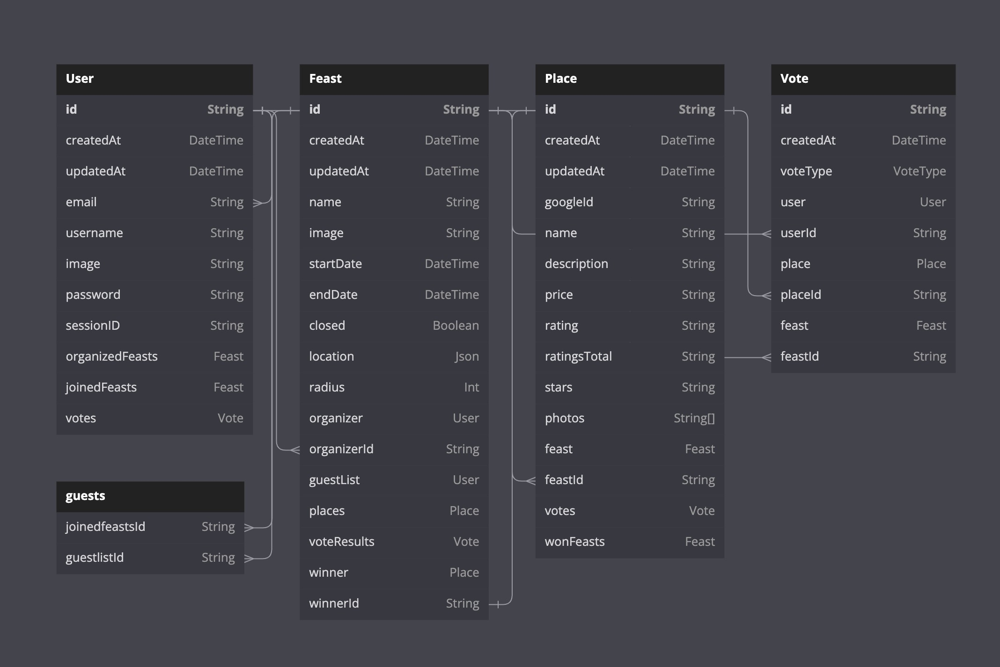

<!--  -->
<h1 align='center'> Dinder Is Served 🍽️</h1>


<h3 align='center'>The backend for <a href='https://github.com/thinktapper/DinderRN'>Dinder</a> 🫃</h3>
<h4 align='center'>RESTful API Server</h4>
<p align='center'>
<a href='#screenshots'>Screenshots</a> •
<a href='#how-its-made'>How It's Made</a> •
<a href='#usage'>Usage</a> •
<a href='#optimizations'>Optimizations</a> •
<a href='#summary'>Summary</a> •
<a href='#author'>Author</a>
</p>
<br />

🚀 **Live project:** <a href='https://dinder-is-served-init.onrender.com/health'>Dinder Is Served</a>

### Screenshots

<details>
  <summary>Show Images</summary>
    
    
    
    
    
    
</details>
<!-- <br /> -->

## 🧑‍🔬 How It's Made

Designed and built from scratch using the Node.js runtime & Express.js for handling routes and creating <a href='https://github.com/thinktapper/DinderRN'>Dinder's</a> API endpoints. Users are able to create accounts and log in, update profile information and create location-based feasts containing restaurants tailored to their occasion. Real-time establishment data is sourced from Google Maps and are stored alongside user votes in a PostgreSQL database. I also created authentication middleware to protect the API using JWTs, and authorization middleware to prevent voter fraud. The web service and hosted DB are both deployed on [Render](https://render.com/).

### Built With:

<!-- - [![JWT][jwt]][jwt-url] -->

- [![Node][node]][node-url]
- [![Prisma][prisma]][prisma-url]
- [![Express][express]][express-url]
- [![TypeScript][typescript]][typescript-url]
- [![PostgreSQL][postgresql]][postgresql-url]
- [![GoogleMaps][googlemaps]][googlemaps-url]

### Database Schema:



<br />

## 🏗️ Usage

1. **Clone the repository**

   `git clone https://github.com/thinktapper/DinderIsServed.git`

2. **Install the necessary packages**

   Go to the main directory and install the necessary packages

   ```sh
   cd DinderIsServed/
   npm i
   ```

3. **Add credentials**

   A `.env` file will need to be added to the project root with the following variables:

   ```sh
   DATABASE_URL="postgresql://<username>:<password>@localhost:5432/<database>?schema=public"
   SECRET="<your-jwt-secret>"
   GOOGLE_API="<your-google-maps-api-key>"
   ```

4. **Create the database**

   ```sh
    npx prisma migrate dev --name init
   ```

5. **Run the server**

   ```sh
    npm run dev
   ```

   The server will be running on `localhost:3000`
   <br />

## 🏋️‍♂️ Optimizations

With time, I plan to add the following features:

- [x] Implement rate limiting to prevent brute force attacks
- [ ] Resolve security vulnerabilities in dependencies
- [ ] Add feature for users to create groups of friends/family members called **Herds**
- [ ] Create sharable links for inviting other users (registered or not) to join Herds
- [ ] Add a feature so users can add restaurants to their favorites
- [ ] Add a feature so users can filter restaurants by various criteria
  - [ ] Add options for that criteria in the feast creation form & persist in the database
- [ ] Add more detailed documentation for the API endpoints.

See the [open issues](https://github.com/thinktapper/DinderIsServed/issues) for a full list of proposed features (and known issues).
<br />

## 📝 Summary

This project was a great way to learn more about the backend and how to create a Node + Express REST API server in TypeScript. I learned a lot about authentication & authorization by rolling my own middleware, and how to deploy a secure API.

### Key takeaways:

<ul>
  <li>Strengthened skills needed to plan, scope, research, and deploy an API.</li>
  <li>Learned how to use JWTs to authenticate users and protect routes.</li>
  <li>Practiced creating middleware to protect voting integrity amongst users.</li>
  <li>Practiced using Prisma to generate relational database models and interact with the DB.</li>
  <li>Learned out to create a seed script to populate the database with mock data.</li>
  <li>Learned how to use the Google Maps API to fetch real-time restaurant data.</li>
  <li>Learned how to set up continuous deployment with CI.</li>
  <li>Gained experience debugging and troubleshooting TypeScript and ESLint build errors and deployment issues.</li>
</ul>

## 👨‍💻 Author

[![MadeByTapper][madeby-tapper]][madeby-tapper-url] [![LinkedIn][linkedin-shield]][linkedin-url]

Andrew Tapper - [@thinktapper](https://twitter.com/thinktapper) - andrew@tapper.codes

Client app: [https://github.com/thinktapper/DinderRN](https://github.com/thinktapper/DinderRN)

Parent Project: [https://github.com/thinktapper/dinder](https://github.com/thinktapper/dinder)

## License

[![GNU License][license-shield]][license-url]

Distributed under the GNU GPLv3. See `LICENSE` for more information.

[license-shield]: https://img.shields.io/github/license/thinktapper/DinderRN?style=for-the-badge
[license-url]: https://github.com/thinktapper/DinderRN/blob/main/LICENSE
[linkedin-shield]: https://img.shields.io/badge/-LinkedIn-black.svg?style=for-the-badge&logo=linkedin&colorB=555
[linkedin-url]: https://linkedin.com/in/thinktapper
[googlemaps]: https://img.shields.io/badge/googlemaps-red?style=for-the-badge&logo=googlemaps&logoColor=white
[googlemaps-url]: https://developers.google.com/maps
[prisma]: https://img.shields.io/badge/prisma-35495E?style=for-the-badge&logo=prisma&logoColor=4FC08D
[prisma-url]: https://prisma.io
[postgresql]: https://img.shields.io/badge/postgresql-4169E1?style=for-the-badge&logo=postgresql&logoColor=white
[postgresql-url]: https://postgresql.org/
[node]: https://img.shields.io/badge/node-339933?style=for-the-badge&logo=nodedotjs&logoColor=white
[node-url]: https://nodejs.org/
[express]: https://img.shields.io/badge/express-000000?style=for-the-badge&logo=express&logoColor=white
[express-url]: https://expressjs.com/
[jwt]: https://img.shields.io/badge/JWT-000000?style=for-the-badge&logo=jsonwebtokens&logoColor=white
[jwt-url]: https://jwt.io/
[typescript]: https://img.shields.io/badge/typescript-007ACC?style=for-the-badge&logo=typescript&logoColor=white
[typescript-url]: https://www.typescriptlang.org/
[madewith-love]: https://img.shields.io/badge/made%20with-%E2%9D%A4-red?style=for-the-badge
[madewith-love-url]: https://tapper.codes
[madeby-tapper]: https://img.shields.io/badge/made%20by-tapper-blue?style=for-the-badge
[madeby-tapper-url]: https://tapper.codes
